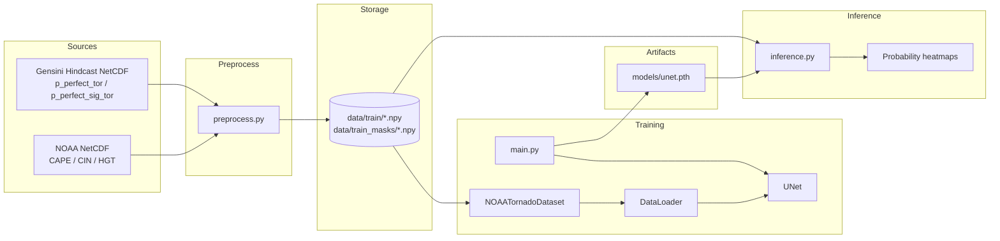
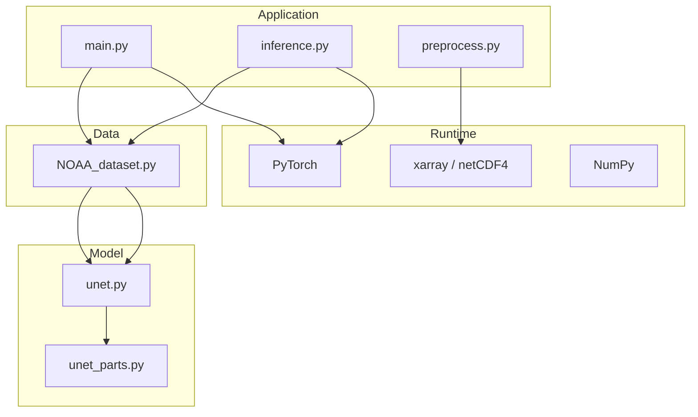
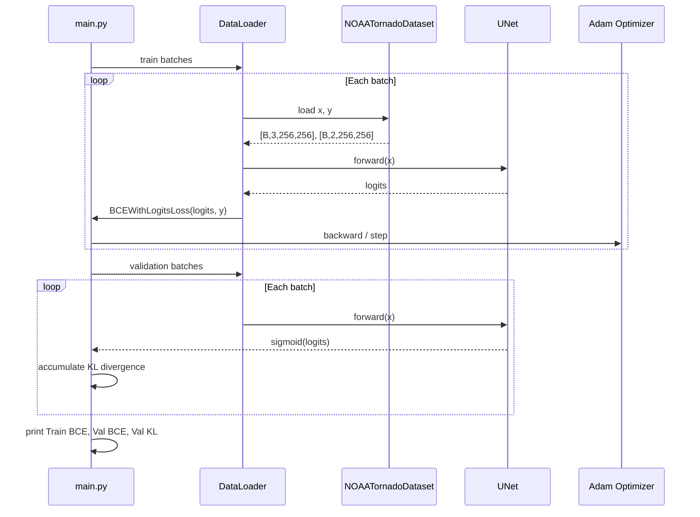
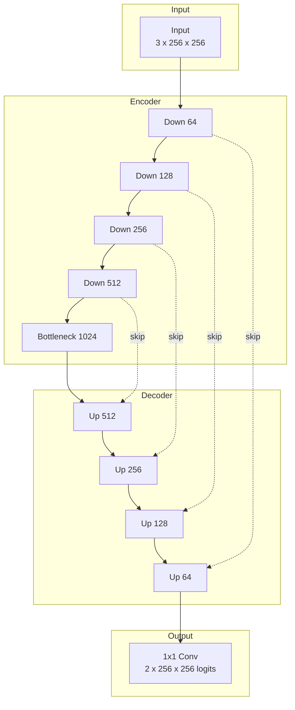

# Weather Forecasting U-Net

A PyTorch implementation of a U-Net for **spatial tornado probability forecasting** over the contiguous United States (CONUS). The project ingests NOAA reanalysis-style atmospheric fields and predicts pixel-wise probability maps for ordinary and significant tornadoes, following the approach described in the Stanford CS231n report [*Weather Forecasting UNET*](https://cs231n.stanford.edu/2024/papers/weather-forecasting-unet.pdf) (Meza, Anderson, Tsultrim, 2024).

The codebase evolved from the classic [milesial/Pytorch-UNet](https://github.com/milesial/Pytorch-UNet) segmentation template (originally trained on the Carvana dataset) and was adapted for multi-channel geospatial inputs and dual-channel probabilistic outputs.

---

## Table of Contents

1. [Problem Statement](#problem-statement)
2. [System Architecture](#system-architecture)
3. [Repository Structure](#repository-structure)
4. [Data Requirements](#data-requirements)
5. [Installation](#installation)
6. [Preprocessing Pipeline](#preprocessing-pipeline)
7. [Training](#training)
8. [Inference and Evaluation](#inference-and-evaluation)
9. [Model Architecture](#model-architecture)
10. [Configuration Reference](#configuration-reference)
11. [Google Colab Workflow](#google-colab-workflow)
12. [Limitations and Future Work](#limitations-and-future-work)
13. [References](#references)

---

## Problem Statement

Traditional severe-weather ML often treats each grid point independently (logistic regression, decision trees). Tornado risk, however, is inherently **spatial**: fronts, helicity gradients, and synoptic patterns extend across regions. A U-Net captures these spatial dependencies via convolution and skip connections.

| Component | Description |
|-----------|-------------|
| **Input** | Three aligned 256x256 grids: CAPE, CIN, and tropopause geopotential height |
| **Output** | Two 256x256 probability maps: any tornado within ~25 mi; significant tornado (EF2+) |
| **Training objective** | Weighted binary cross-entropy with logits |
| **Validation metric** | Bernoulli KL divergence between predicted and hindcast probabilities |

---

## System Architecture

### End-to-end pipeline



### Software layers



### Training loop (per epoch)



---

## Repository Structure

```
Unet-implementation/
├── README.md                 # Project documentation (this file)
├── main.py                   # Training script
├── inference.py              # Visualization and single-day inference
├── preprocess.py             # NetCDF to NumPy conversion
├── NOAA_dataset.py           # PyTorch Dataset for weather grids
├── unet.py                   # U-Net assembly
├── unet_parts.py             # Encoder/decoder building blocks
├── requirements.txt          # Core Python dependencies
├── models/                   # Saved checkpoints (created at train time)
├── data/                     # Preprocessed NumPy tensors (not in git)
│   ├── train/
│   │   ├── cape/
│   │   ├── cin/
│   │   └── geo/
│   ├── train_masks/
│   │   ├── tornado/
│   │   └── sigtor/
│   ├── manual_test/          # Optional holdout for inference.py
│   └── manual_test_masks/
└── Main_Unet/                # Original Carvana reference scripts (archived)
    ├── main_ex.py
    └── inference_ex.py
```

---

## Data Requirements

### Input features (NetCDF, preprocessed to `.npy`)

| Channel | Variable | Typical source | Notes |
|---------|----------|----------------|-------|
| 0 | CAPE | NOAA PSL reanalysis | Surface-based convective available potential energy |
| 1 | CIN | NOAA PSL reanalysis | Convective inhibition |
| 2 | Geopotential height | NOAA PSL reanalysis | Tropopause level |

The reference paper also experiments with MSLP, storm-relative helicity, and air temperature. This repository uses **three channels** by default (`UNet(in_channels=3)`).

### Target labels (NetCDF, preprocessed to `.npy`)

| Channel | NetCDF variable | Description |
|---------|-----------------|-------------|
| 0 | `p_perfect_tor` | Practically perfect hindcast tornado probability |
| 1 | `p_perfect_sig_tor` | Practically perfect significant tornado probability |

Labels represent the smoothed probability of a tornado within approximately 25 miles of each grid point, derived from retrospective storm surveys (Gensini et al., 2020).

### On-disk layout after preprocessing

Every calendar day must use the **same filename** across all five folders (e.g. `2014-06-15.npy`):

```
data/
  train/cape/2014-01-01.npy
  train/cin/2014-01-01.npy
  train/geo/2014-01-01.npy
  train_masks/tornado/2014-01-01.npy
  train_masks/sigtor/2014-01-01.npy
```

Each file should be a 2D `float32` array. The dataset resizes all tensors to **256x256** at load time.

---

## Installation

### Prerequisites

- Python 3.9 or newer
- CUDA-capable GPU recommended for training (optional on CPU for small tests)

### Local setup

```bash
git clone https://github.com/AnubhavDas651629/Unet-implementation.git
cd Unet-implementation

python -m venv venv
source venv/bin/activate        # Windows: venv\Scripts\activate

pip install torch torchvision tqdm matplotlib numpy
pip install xarray netCDF4      # Required only for preprocess.py
```

### Dependency summary

| Package | Used by |
|---------|---------|
| `torch`, `torchvision` | Model, training, resizing |
| `numpy` | Data I/O |
| `tqdm` | Training progress |
| `matplotlib` | Inference plots |
| `xarray`, `netCDF4` | `preprocess.py` |

---

## Preprocessing Pipeline

`preprocess.py` converts raw NetCDF files into the NumPy directory structure expected by `NOAATornadoDataset`.

### Configuration

Edit the path constants at the top of `preprocess.py` before running:

```python
CAPE_PATH = "/path/to/Cape 2014.nc"
CIN_PATH = "/path/to/CIN 2014.nc"
HGT_PATH = "/path/to/HGT Tropo 2014.nc"
TOR_TARGET_PATH = "/path/to/Pper Tor 1979-2023.nc"
SIGTOR_TARGET_PATH = "/path/to/Pper Sig Tor 1979-2023.nc"
OUTPUT_DIR = "./data"
```

### Processing steps

1. Create output subdirectories under `data/`.
2. Load feature and target datasets; slice hindcast files to the target year (e.g. `2014`).
3. Intersect timestamps across CAPE and tornado grids (365 daily samples per year when aligned at 12Z).
4. For each day: extract 2D slices, resize to 256x256 via bilinear interpolation, save as `.npy`.

### Run

```bash
python preprocess.py
```

Expected console output includes `Found 365 perfectly aligned days to process` for a full 2014 feature/target overlap.

### NetCDF variable names

| File type | Variable name in code |
|-----------|----------------------|
| CAPE | `cape` |
| CIN | `cin` |
| Height | `hgt` |
| Tornado label | `p_perfect_tor` |
| Significant tornado label | `p_perfect_sig_tor` |

---

## Training

### Chronological split (current default)

`main.py` performs a **time-ordered** split on sorted filenames (not random):

| Split | Index range | Typical size (365-day year) |
|-------|-------------|-------------------------------|
| Training | First 250 days | Jan through late Aug |
| Validation | Days 251-310 | Sep through Oct |
| Unused | Days 311-365 | Available for `manual_test/` |

### Run locally

```bash
mkdir -p models
python main.py
```

### Expected output

```
Using device: cuda
Total available days found for processing: 365
Split Summary -> Training Days: 250 | Validation Days: 60
--------------------------------------------------
Epoch 1/10
  Train BCE: 0.xxxx
  Val BCE:   0.xxxx
  Val KL:    0.xxxx
--------------------------------------------------
Model saved to ./models/unet.pth
```

### Hyperparameters (defaults in `main.py`)

| Parameter | Default | Notes |
|-----------|---------|-------|
| `LEARNING_RATE` | `1e-4` | Adam optimizer |
| `BATCH_SIZE` | `8` | Reduce if OOM on laptop; increase to 32-64 on Colab GPU |
| `EPOCHS` | `10` | Increase for production runs |
| `pos_weight` | `[50, 100]` | Per-channel positive-class weighting for rare tornado pixels |

---

## Inference and Evaluation

`inference.py` loads `models/unet.pth`, applies `torch.sigmoid` to logits, and renders probability heatmaps (no binary thresholding).

### Prerequisites

Create a holdout set under `data/manual_test/` and `data/manual_test_masks/` with the same five-folder structure as `train/`. Copy unused days from the chronological split (e.g. November-December) or any held-out dates.

### Run

```bash
python inference.py
```

### Available functions

| Function | Purpose |
|----------|---------|
| `pred_show_image_grid()` | Multi-sample comparison grid (CAPE, true/pred tornado, true/pred sigtor) |
| `single_sample_inference()` | Detailed panels for one test index |
| `single_day_inference_from_npy()` | Inference from explicit `.npy` filenames |

---

## Model Architecture

Standard four-level U-Net with skip connections. Input spatial size 256x256; four max-pool stages reduce to 16x16 at the bottleneck.



### Tensor shapes

| Stage | Shape |
|-------|-------|
| Input `x` | `[B, 3, 256, 256]` |
| Output logits | `[B, 2, 256, 256]` |
| After sigmoid (inference) | `[B, 2, 256, 256]` in `[0, 1]` |

### Building blocks (`unet_parts.py`)

- **DoubleConv**: Two 3x3 convolutions, ReLU, same padding.
- **DownSample**: DoubleConv followed by 2x2 max pooling; returns skip tensor and pooled tensor.
- **UpSample**: Transposed convolution (upsample), concatenation with skip feature, DoubleConv.

---

## Configuration Reference

| File | Key constants |
|------|---------------|
| `main.py` | `DATA_PATH`, `MODEL_SAVE_PATH`, `BATCH_SIZE`, `EPOCHS` |
| `preprocess.py` | NetCDF input paths, `OUTPUT_DIR` |
| `inference.py` | `DATA_PATH`, `MODEL_PATH` (in `__main__`) |

---

## Google Colab Workflow

Large preprocessed datasets should live on **Google Drive**, not in the git repository.

### Recommended layout on Drive

```
My Drive/unet/
  data/
    train/cape/*.npy
    ...
  models/
    unet.pth
  data.zip          # Optional upload archive
```

### Colab setup cells

```python
# 1. Clone repository
!git clone https://github.com/AnubhavDas651629/Unet-implementation.git
%cd Unet-implementation

# 2. Install dependencies
!pip install -q torch torchvision tqdm matplotlib numpy

# 3. Mount Drive
from google.colab import drive
drive.mount("/content/drive")

DATA_PATH = "/content/drive/MyDrive/unet/data"
MODEL_PATH = "/content/drive/MyDrive/unet/models/unet.pth"
```

Verify data path before training:

```python
import glob
n = len(glob.glob(f"{DATA_PATH}/train/cape/*.npy"))
print(f"Days found: {n}")
assert n > 0, "train/cape is empty or DATA_PATH is wrong"
```

Unzip if needed:

```python
!unzip -q "/content/drive/MyDrive/unet/data.zip" -d "/content/drive/MyDrive/unet"
```

Patch paths and train:

```python
import pathlib, os
text = pathlib.Path("main.py").read_text()
text = text.replace('DATA_PATH = "./data"', f'DATA_PATH = "{DATA_PATH}"')
text = text.replace('MODEL_SAVE_PATH = "./models/unet.pth"', f'MODEL_SAVE_PATH = "{MODEL_PATH}"')
text = text.replace("BATCH_SIZE = 8", "BATCH_SIZE = 32")
pathlib.Path("main.py").write_text(text)
os.makedirs(os.path.dirname(MODEL_PATH), exist_ok=True)

!python main.py
```

Enable **Runtime > Change runtime type > GPU** before training.

### Common Colab error

```
FileNotFoundError: .../data/train/cape
```

**Cause:** `DATA_PATH` does not match the actual Drive folder, or `data.zip` was not extracted.

**Fix:** Run `!find /content/drive/MyDrive/unet -type d -name cape` to locate `train/cape`, then set `DATA_PATH` to the parent of `train/`.

---

## Limitations and Future Work

| Topic | Current state | Suggested improvement |
|-------|---------------|----------------------|
| Input channels | 3 (CAPE, CIN, HGT) | Add MSLP, SRH, temperature (6-channel U-Net) |
| Grid alignment | Independent resize of features (91x180) and labels (65x93) | Regrid all sources to common lat/lon before training |
| Label resizing | Bilinear in `preprocess.py` | Nearest-neighbor for probability masks |
| Train/val split | Chronological index slices | Year-based split per CS231n paper |
| Loss | Weighted BCE | KL divergence or focal loss for training |
| Test set | Manual copy to `manual_test/` | Automated split script |
| Multi-year data | 2014 prototype | Extend `preprocess.py` loop over years |

---

## References

1. Meza, J., Anderson, N., Tsultrim, T. (2024). *Weather Forecasting UNET*. Stanford CS231n course project. https://cs231n.stanford.edu/2024/papers/weather-forecasting-unet.pdf

2. Gensini, V. A., Haberlie, A. M., & Marsh, P. T. (2020). Practically Perfect Hindcasts of Severe Convective Storms. *Bulletin of the American Meteorological Society*, 101(8), E1259-E1278. https://doi.org/10.1175/BAMS-D-19-0321.1

3. Ronneberger, O., Fischer, P., & Brox, T. (2015). U-Net: Convolutional Networks for Biomedical Image Segmentation. https://arxiv.org/abs/1505.04597

4. milesial. Pytorch-UNet. https://github.com/milesial/Pytorch-UNet

5. NOAA Physical Sciences Laboratory. https://www.psl.noaa.gov/

---

## License

This repository is provided for educational and research use. Verify licensing terms for NOAA and hindcast datasets before redistribution. The original U-Net implementation follows the license of the milesial/Pytorch-UNet project.
